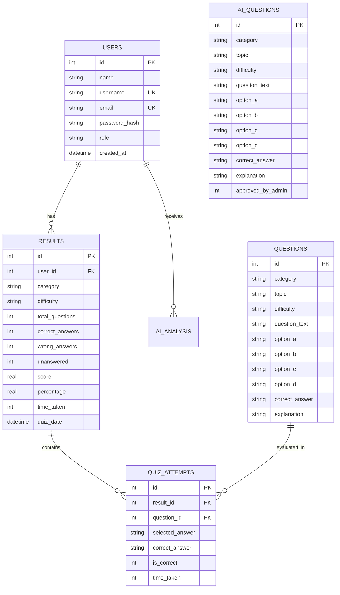

# QuizMaster AI — Intelligent Educational Assessment & Personalized Learning Platform

[](https://www.python.org/)
[](https://docs.python.org/3/library/tkinter.html)
[](https://www.sqlite.org/)
[](https://aistudio.google.com/)
[]()

---

## 1. Project Title
**QuizMaster AI** — Next-Generation Interactive Assessment & AI-Powered Personalized Learning Platform.

---

## 2. Project Overview
**QuizMaster AI** is a modern, high-contrast desktop application designed for educational assessment and adaptive learning. It bridges the gap between traditional multiple-choice quiz engines and modern generative AI technology. 

> **Core Architectural Principle:**
> All measurable statistics, quiz scoring, grading, timers, and progress metrics are driven strictly by **deterministic Python algorithms** and relational SQLite storage. **Google Gemini Generative AI** is used exclusively for high-level tutoring, answer rationale synthesis, weak-area topic identification, adaptive difficulty recommendations, and staged question generation.

---

## 3. Problem Statement
Traditional computer-based testing (CBT) applications suffer from key limitations:
- **Static & Generic Feedback:** Students are presented with right/wrong indicators without deep explanations of *why* an option was correct or incorrect.
- **One-Size-Fits-All Difficulty:** Quizzes remain fixed regardless of a student's prior mastery or recent learning progression.
- **Manual Question Bank Creation:** Educators spend countless hours manually drafting options, correct keys, and explanations.
- **Lack of Actionable Study Guidance:** Raw test scores fail to offer structured, actionable revision timelines targeting specific weak topics.

---

## 4. Objectives
- **Modernize Assessment Desktop UI:** Deliver a sleek, professional desktop application using custom-styled Tkinter interfaces adhering to standardized design tokens.
- **Ensure Strict Assessment Integrity:** Maintain 100% deterministic Python calculation for scores, percentages, attempt logs, and leaderboards.
- **Provide AI-Assisted Personalization:** Leverage LLMs for context-aware answer explanations, personalized 7-day study plans, and adaptive difficulty suggestions.
- **Implement Safe AI Admin Staging:** Ensure AI-generated questions enter a pending queue (`ai_questions`) requiring explicit human admin approval before joining the active question bank.

---

## 5. Core Application Features

### 🎓 Student Experience
- **Interactive Student Dashboard:** Real-time metrics displaying overall score, quizzes completed, strongest category, weakest category, and recommended difficulty.
- **Customizable Quiz Engine:** Launch practice sessions filtered by category (Python, C++, Java, DBMS, Computer Networks, General Knowledge) or difficulty (Easy, Medium, Hard).
- **Practice My Weak Areas:** One-click automated quiz launcher targeting student weak topics identified by historical test attempts.
- **Dynamic Quiz Timer Badge:** High-contrast countdown timer badge (`⏱️ 02:45`) changing state to Amber (<60s) and Crimson Red (<30s).
- **Result & Itemized Review Screen:** Interactive percentage score overview with itemized question review cards and optional instant AI explanations.
- **Personalized AI Study Plan:** Generates a structured 7-day revision timeline targeting student weak topics.
- **24/7 AI Study Assistant:** Interactive academic tutor chatbot supporting quick-hint prompts and concept explanations within a safe 20-turn conversation limit.
- **Global Leaderboard & History:** Visual score rankings and downloadable quiz attempt history.

### 🛡️ Admin Management Panel
- **Question Bank CRUD:** Add, search, edit, and delete questions with instant validation.
- **AI Question Generator:** Enter topic, category, difficulty, and quantity to generate structured question sets.
- **Human-in-the-Loop Review Queue:** Preview, approve, or reject staged AI questions before they enter the main database.
- **Student Performance Oversight:** Monitor student attempt logs and summary statistics.

---

## 6. AI Features & Isolation Architecture

| AI Feature | Role & Responsibility | Guardrails & Constraints |
| :--- | :--- | :--- |
| **Question Generator** | Generates structured 4-option questions with correct key & explanation. | Saved to `ai_questions` with `approved_by_admin = 0`. Excluded from quizzes until admin approval. |
| **Answer Explanation** | Produces a 3-part rationale: (1) Why correct is correct, (2) Why student answer was incorrect, (3) Learning tip. | Read-only feedback. Cannot modify stored correct answer or adjust quiz score. |
| **Performance Analysis** | Synthesizes weak topics, strong areas, and revision priorities. | Consumes pre-aggregated Python statistics; does not calculate scores directly. |
| **Adaptive Recommendation**| Suggests next difficulty (Easy, Medium, Hard) based on historical accuracy. | Transparent advice. Students retain manual override power to choose any difficulty. |
| **7-Day Study Plan** | Creates daily action items targeting weak topics. | Persisted in `ai_analysis` table for student reference. |
| **AI Study Assistant** | Academic chatbot offering concept explanations and hints. | Academic system prompt; refuses code execution and system database modifications. |

---

## 7. Technology Stack

- **Programming Language:** Python 3.10+
- **GUI Framework:** Standard `tkinter` & `ttk` (Custom styled with Segoe UI dark theme tokens)
- **Database Engine:** SQLite3 (Embedded relational storage with foreign key constraints)
- **AI Service:** Google Gemini API (`google-generativeai` SDK, `gemini-2.5-flash` model)
- **Configuration & Environment:** `python-dotenv`
- **Data Analytics & Charts:** `matplotlib` (Embedded Tkinter Canvas charts)
- **Unit Testing Framework:** Python Standard Library `unittest` (115 passing tests)

---

## 8. System Architecture

QuizMaster AI uses a **Clean Layered Architecture** ensuring complete separation of presentation, business logic, data storage, and AI service integration:

```
┌────────────────────────────────────────────────────────────────────────┐
│                        PRESENTATION LAYER (GUI)                        │
│   App Container, Student Dashboard, Quiz Screen, Admin Panel, Assistant    │
└──────────────────────────────────┬─────────────────────────────────────┘
                                   │ Call Services
┌──────────────────────────────────▼─────────────────────────────────────┐
│                         BUSINESS SERVICE LAYER                         │
│   AuthService  │  QuizService  │  ResultService  │  AIService          │
└─────────┬────────────────────────┬────────────────────────┬────────────┘
          │ Parameterized Queries  │ Aggregates Stats       │ Async Requests
┌─────────▼───────────┐  ┌─────────▼───────────┐  ┌─────────▼────────────┐
│   DATABASE LAYER    │  │   DOMAIN MODELS     │  │  AI INTEGRATION      │
│ DatabaseManager     │  │ User, Student,      │  │ Google Gemini API    │
│ SQLite3 Storage     │  │ Question, Result    │  │ (ThreadPoolExecutor) │
└─────────────────────┘  └─────────────────────┘  └──────────────────────┘
```

---

## 9. Database Design & Relational Schema

The database relies on SQLite3 with strict schema constraints and foreign key cascading.



---

## 10. Object-Oriented Programming (OOP) Concepts

- **Encapsulation:** All services (`AuthService`, `QuizService`, `ResultService`, `AIService`) encapsulate state, database handles, and private helper functions (e.g., `_call_gemini()`, `_extract_and_validate_json()`).
- **Inheritance:** Domain models inherit from base abstractions (`Student` and `Admin` extend the base `User` model; custom Tkinter screens inherit from `tk.Frame`).
- **Polymorphism:** Method overriding across screen lifecycle handlers (`on_show()`, `_render_study_plan()`).
- **Abstraction:** `DatabaseManager` hides raw SQLite connection handling, parameter binding, and transaction execution behind high-level methods (`fetch_all()`, `execute_query()`).
- **Composition:** `App` container orchestrates screen instances and manages shared service dependencies.

---

## 11. Installation Guide

### Prerequisites
- Python 3.10 or higher installed on your system.
- Git installed.

### Step 1: Clone the Repository
```bash
git clone https://github.com/your-username/QuizMasterAI.git
cd QuizMasterAI
```

### Step 2: Create and Activate Virtual Environment
```bash
# Windows
python -m venv venv
venv\Scripts\activate

# macOS / Linux
python3 -m venv venv
source venv/bin/activate
```

### Step 3: Install Required Dependencies
```bash
pip install -r requirements.txt
```

---

## 12. Environment Variable Setup

1. Copy the template file `.env.example` to create your active `.env` configuration:
   ```bash
   # Windows PowerShell / CMD
   copy .env.example .env

   # Linux / macOS
   cp .env.example .env
   ```
2. Open `.env` in any text editor and configure your parameters:
   ```env
   # Google Gemini API Key (Get free key at: https://aistudio.google.com/)
   GEMINI_API_KEY=your_gemini_api_key_here

   # Model Identifier
   GEMINI_MODEL=gemini-2.5-flash

   # Maximum request timeout in seconds
   AI_REQUEST_TIMEOUT=15
   ```
> *Note: If `GEMINI_API_KEY` is not provided, QuizMaster AI automatically runs in **Offline Fallback Mode**, providing predefined deterministic practice responses without crashing.*

---

## 13. Database Initialization & Seeding

To initialize the SQLite database schema and populate 110 standard questions across Python, C++, Java, DBMS, Computer Networks, and General Knowledge:

```bash
python seed_data.py
```

*Output Confirmation:*
```
============================================================
🌱 QuizMaster AI — Database Seeding Script
============================================================
[DB Seed Result] Added: 110 | Skipped (Already Existed): 0 | Total Items: 110
============================================================
```

---

## 14. Running the Application

### Option A: One-Click Launch (Recommended for Windows)
Simply **double-click** any of the following created launcher shortcuts:
1. **Desktop Shortcut:** Double-click **`QuizMaster AI`** directly on your Windows Desktop.
2. **Silent Launcher:** Double-click **`run_quizmaster.vbs`** in the project folder (runs silently without opening a black command prompt window).
3. **Batch Launcher:** Double-click **`run_quizmaster.bat`** in the project folder.

> *The one-click launchers automatically verify your Python environment, initialize/seed the database if needed, and launch the QuizMaster AI interface immediately.*

### Option B: Command Line Launch
Launch via Python terminal:
```bash
python main.py
```


---

## 15. Admin Setup & Default Credentials

During database seeding, a default administrator account is initialized:

| Field | Value |
| :--- | :--- |
| **Role** | System Administrator |
| **Username** | `admin` |
| **Password** | `admin123` |

Log in using these credentials to access the **Admin Panel**, manage the question bank, and review staged AI questions.

---

## 16. Automated Test Suite Execution

QuizMaster AI includes a full test suite with **115 automated unit and integration tests** covering all auth, database, engine, result, admin, and AI features using mocked API calls.

Run the entire test suite using Python's standard `unittest`:

```bash
python -m unittest discover -s tests -p "test_*.py"
```

*Expected Output:*
```
Ran 115 tests in 13.551s

OK
```

---

## 17. User Interface Screenshots

*(Placeholders for application walkthrough screenshots)*

| Screen | Preview Placeholder |
| :--- | :--- |
| **Student Learning Dashboard** | `` |
| **Interactive Quiz Screen** | `` |
| **AI Study Plan & Timeline** | `` |
| **AI Academic Assistant Chat** | `` |
| **Admin Panel & Question Staging** | `` |

---

## 18. Future Enhancements

- **Voice-Assisted AI Tutor:** Integrate speech-to-text and text-to-speech for hands-free study assistant interactions.
- **Multi-Tenant LMS Export:** Support exporting test questions to QTI and Canvas/Moodle compatible XML formats.
- **Real-Time Code Execution Sandbox:** Add isolated Docker/Pyodide container execution for coding questions.
- **Dynamic Theme Switcher:** Allow toggling between Dark Mode and Light Mode.

---

## 19. Limitations

- **Desktop Scope:** Designed as a desktop application using Tkinter; not accessible via mobile browser without remote desktop streaming.
- **Offline AI Functionality:** Live AI explanations and personalized study plans require an active internet connection to communicate with the Gemini API (though offline fallback modes keep practice quizzes functional).
- **SQLite Concurrency:** SQLite is optimized for single-client desktop database storage; multi-thousand concurrent web connections would require migrating to PostgreSQL.

---

## 20. Project Structure

```
QuizMasterAI/
│
├── database/
│   ├── database.py             # DatabaseManager connection & query execution
│   ├── schema.py               # DDL schema definitions & admin seeding
│   └── seed_data.py            # 110-question database seed data set
│
├── gui/
│   ├── admin_panel.py          # Admin Question CRUD & AI Staging Queue UI
│   ├── ai_assistant.py         # AI Academic Tutor Chatbot UI
│   ├── app.py                  # Tkinter Main Window & Navigation Controller
│   ├── leaderboard.py          # Student Leaderboard UI
│   ├── login.py                # Login Screen UI
│   ├── performance.py          # Analytics & Matplotlib Visualizations UI
│   ├── quiz_history.py         # Student Quiz History Logs UI
│   ├── quiz_screen.py          # Interactive Timed Quiz Session UI
│   ├── quiz_selection.py       # Quiz Configuration Launcher UI
│   ├── register.py             # Student Registration Screen UI
│   ├── result_screen.py        # Quiz Result Summary & AI Explanation UI
│   ├── student_dashboard.py    # Main Student Learning Dashboard UI
│   └── study_plan.py           # 7-Day AI Revision Plan UI
│
├── models/
│   ├── question.py             # Question Domain Model
│   ├── quiz.py                 # Quiz Domain Model
│   ├── result.py               # Result & Attempt Models
│   └── user.py                 # User, Student, and Admin Domain Models
│
├── services/
│   ├── ai_service.py           # Gemini API Integration Layer & Fallbacks
│   ├── authentication.py       # User Registration, Hashing, & Session Service
│   ├── quiz_service.py         # Question Bank CRUD & Staging Service
│   └── result_service.py       # Score Calculation & Analytics Aggregator
│
├── tests/                      # 24 Test Modules (115 Passing Tests)
│   ├── test_ai_service.py
│   ├── test_authentication.py
│   ├── test_database.py
│   ├── test_quiz.py
│   ├── test_result_system.py
│   └── ...
│
├── utils/
│   ├── constants.py            # Design Tokens (Colors, Typography, Spacing)
│   └── validators.py           # Input Validation Helper Functions
│
├── .env.example                # Environment Variable Template
├── .gitignore                  # Git Exclusion Definitions
├── main.py                     # Application Entry Point
├── README.md                   # Project Documentation
├── requirements.txt            # Python Dependencies Specification
└── seed_data.py                # Root Seeding Entry Script
```

---

*QuizMaster AI — Developed with Python, Tkinter, SQLite, and Google Gemini AI.*
